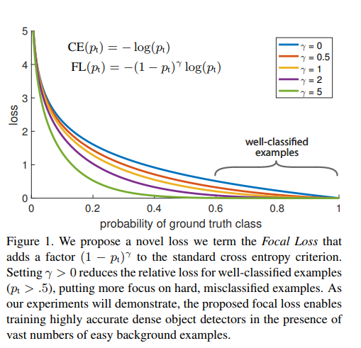

Focal Loss for Dense Object Detection
=====================================

#############################
1. Introduction
#############################

Current state of art object detector: R-CNN framewor. Process

1. Generates a sparse set of condidate object locations 
2. Classifies each condidate location as one of the foreground classes or as background 

This 2-stage framework consitently achieves top **accuracy** on the challenging COCO benchmark.

One stage detector: YOLO, SSD. Faster with accuracy within 10-40% relative to state of art two-stage methods.

This paper: one-stage object detector, matches state of art COCO AP of more complex 2-stage detector. To achive this result, we identify imbalance during training as the main obstacle impeding 1-stage detector and propose a new loss function that eliminates this barrier. 

* Class imbalance is addressed in R-CNN-like detectors by 2-stage cascade and sampling heuristics. 

	1. The proposal stage rapidly narrows down the number of candidate object locatios to a small number (e.e 1-2k). 
	2. In the second classification stage, sampling heuristics are performed to maintain a managable balance between foreground and background.

* 1-stage detector must process a much larger set of canidate object location regularly sampled accross an image (~ 100k locations). While similar sampling heuristics may also be applied, they are inefficient as the training procedure is still dominated by easily classifid background examples. This inefficiency is typically addressed via techniques such as bootstrapping or hard example mining.
* This paper, we propose a new loss function that act as a more effective alternative to previous approaches for dealing with class imbalance. Loss function is dynamically scaled cross entropy loss, where the scaling factor decays to 0 as confidence in the correct class increases. 

This scaling factor can automatically down-weight the contribution of easy examples during training and rapidly focus the model on hard exampls. Finally we note that the exact form of the focal loss is not crucial, and we show other instantials can achive similar results.

#####################################
2. Related work
#####################################

* Classic object detectors: sliding window paradigm, in which a classifier is applied on dense image grid. 
* 2-stage detectors
	
	1. generates a sparse set of condidate proposals that should contain all objects while filtering out the majority of negative locations
	2. classify the proposal into forground classes/background

* 1-stage detectors
	
	* Tuned for speed but accuracy trails that of two-stage method
	* 2-stage detectors can be made fast simply by reducing image resolution and number of proposal

* RetinaNet
	
	* shares many similarities with previous dense detector, such as anchor in RPN, features pyramids in SSD and FPN