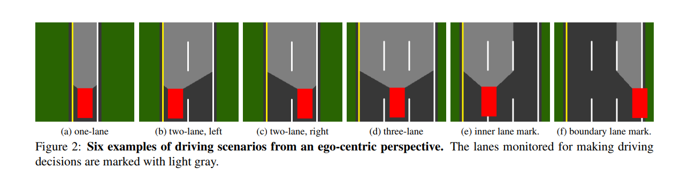
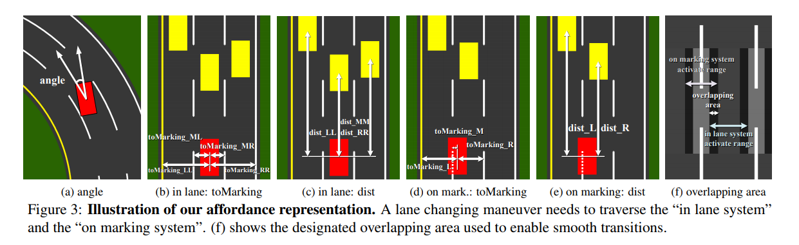

Deep Driving: Learning Affordance for Direct Perception in Autonomous Driving
=================================================================================

`paper <http://deepdriving.cs.princeton.edu/paper.pdf>`_

##################################################
1 Introduction
##################################################

**************************************************
Mediated perception approach
**************************************************

involve multiple components:

1. recognizing driving relevant objects: lanes, traffic light ...
2. combinen recognizing result with world representation of the cars immediate surroundings
3. AI based engine takes akk of this inform into account and make decision.

Encompasses the current state of the art approaches for autonomous driving. 

Small portion of the detected objects are relevant to driving decision, unnecessary complexity. Final output:

* direction
* speed

Mediated perceptiion computes a high-D world representation, possibly redundant information.

Most of these system rely on laser range finders, GPS, radar and very accurate maps of the environment to reliable parse objects in a scene. Many open challenges, increase complexity and cost.

**************************************************
Behavior reflex approach
**************************************************

Construct a direct mapping from the sensory input to a driving action. 

Struggle to deal with traffic and complicated driving maneuvers for several reasons.

* even when input images are similar, different drivers may make completely different decisions, resulting in ill-posed problem that is confusing when training a regressor.
* decision-making for behaviour reflex is too low-level. Direct mapping cannot see a bigger picture of the situation. E.g. passing a car: turning slighly in one direction and the in the other direction for some period of time. This level of abstraction fails to capture what is really going on.
* Input: whole image. Learning algorithm must determine which part of the image are relevant. The level of supervision too weak to force the alogrithm to learn this critical information.

**************************************************
Proposal
**************************************************

Directly predicts the affordance for driving action, instead of visually parsing the entire scene or blindly mapping an image to steering angles. Learn a mapping from an image to several meaningful affordance indicators of the road situation, including 

* angle of the car relative to the road
* distance to the lane markings
* distance to the cars in the current and adjacent lanes

training: ConvNet. screen shot playing video game for 12 hours. 

Define `affordance <https://www.google.com/search?q=affordances&rlz=1C1GCEU_enUS821US821&oq=affordance&aqs=chrome.0.0j69i57j0j69i59j35i39j0.2367j0j7&sourceid=chrome&ie=UTF-8>`_: Affordances are clues about how an object should be used, typically provided by the object itself or its context. For example, even if you've never seen a coffee mug before, its use is fairly natural. The handle is shaped for easy grasping and the vessel has a large opening at the top with an empty well inside.

******************************
1.1 Related work
******************************

2 Key elements of an autonoumous driving system: 

* Car detection: use bounding box
* Lane detection: use slines 

however, not direct affordance information we use for driving. Conversion results in extra noise.

`RNN with RL approach <http://people.idsia.ch/~juergen/gecco2013torcs.pdf>`_
`Neural network perception for mobile robot guidance <https://apps.dtic.mil/dtic/tr/fulltext/u2/a249972.pdf>`_

Check this section for all the work that has been done in this field

###############################################################
2. Learning affordance for driving preception
###############################################################

`TORCS <http://torcs.sourceforge.net/>`_

from the game engine, collect

* speed of host car
* relative position to the roads's central line
* distance to the preceding cars

1. prepare:

	1. drive the label collecting car, first person view
	2. collect the ground truth values of affordance indicators.

2. training
3. testing: at each time step
	
	1. the trained model takes a driving scene image from the game and estimates the affordance indicators for driving.
	2. A driving controller processes the indicator and computes the steering the acceleration/brake command.
	3. Driving commands are then sent back to the game and drive the host car.

**************************************************
2.1 Mapping from an image to affordance 
**************************************************

ConvNet as direct preception model to map an image to the affordance indicators.

Train a single ConvNet to handle 3 configurations: 1 lane, 2 lanes and 3 lanes. 

two major types of action:

1. follow the lane certer line
2. change lane and slow down to avoid collision with proceding cars

to support these action, define two sets of representation under 2 coordinate system

1. In lane system
2. On marking system

3 types of indicators to represent driving situation:

* heading angle
* distance to nearby lane markings
* distance to the precding cars

In total, 13 indicators:

All 13 indicators:

1. Always
	
	1. angle: angle between the car's heading and the tangent of the road

2. "in lane system", when driving in the lane

	2. toMarking_LL: distance to the left lane marking of the left lane
	3. toMarking_ML: distance to the left lane marking of the current lane
	4. toMarking_MR: distance to the right lane marking of the current lane
	5. toMarking_RR: distance to the right lane marking of the right lane
	6. dist_LL: distance to the proceding car in the left lane
	7. dist_MM: distance to the proceding car in the current lane
	8. dist_RR: distance to the proceduing car in the right lane

3. "on marking system", when driving on the lane marking
	
	9. toMarking_L: distance to the left lane marking 
	10. toMarking_M: distance to the central lane marking
	11. toMarking_R: distance to the right lane marking
	12. dist_L: distance to the proceding car in the left lane
	13. dist_R: distance to the proceding car in the right lane

The inline system and on marking system are activated under different conditions. To have smooth transition, we define an overlapping area. 

Except for the heading angle, all the indicators may output an inactive  state. There are 2 cases in which a indicator will be inactive:

1. when the car is driving in either the "inlane system" or "on marking system" and the other system is deactivated, then all the indicators belonging to that system is inactive.
2. when the car is driving on boundary lanes (left most or right most lane), and there is either no left lane or no right lane, then the indicators corresponding to the non-existing adjacent lane is inactive.  

