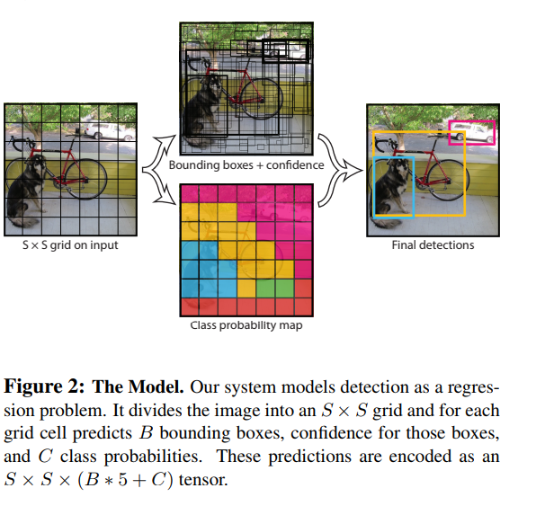

YOLO
===================

See `Yolo Paper <https://arxiv.org/pdf/1506.02640.pdf>`_ 

################
1. Intro
################
Over all Sturcture/Pipeline:

1. Resize to 448 * 448
2. Conv Net
3. Threshhold the resulting detection by the model's confidence.  

A single conv net simultaneously predicts multiple bounding boxes and class probabilities for those boxes. It is trained on full image and directly optimizes detection performance. Benefit over traditional method of object detection.

1. Fast. Regression problem, no need for complex pipeline. High precision
2. Reason gloabally about the image when making prediction. 
3. Leans generalizable representation of objects. Less likely to break down when applied to new domain or unexpected inputs.

Drawback: 
Lag behind state-of-art detection system in accuracy. Struggle to precisely localize some objects. especially small ones 

###########################
2. Unified Detection
###########################

Divide the image into S * S grid. If the center of the an object falls into a grid cell, that grid cell is responsible for detecting that object. Each grid cell predicts B bounding boxes and confidence scores for those boxes. We define confidence as :math:`Pr(Object) * IOU_{true pred}`. `IOU <https://www.pyimagesearch.com/2016/11/07/intersection-over-union-iou-for-object-detection/>`_ is between the predicted box and the groud truth.

.. image:: rsc/iou_equation.png

For each **bounding box** (not grid cell), we have 5 prediction cell: x, y, w, h, and confidence. 

* (x, y) represent the center of the box relative to the bound of the grid cell.
* (w, h) represent width and height relative to the whole image
* confidence represent IOU between the prediction box and any ground truth box.

Each **grid cell** (not bounding box) also predict C conditional class probabilities :math:`Pr(Class_i | Object)`. These probabilities are conditioned on the grid cell contraining an object. We only predict one set of class probability per grid cell, regardless of the number of the boxes.

At test time, class-specific confidence scores for each box:

.. math::
	
	Pr(Class_i | Object) * Pr(Object) * IOU_{true prob} = Pr(Class_i) * IOU_{true prob}

These score encode both 

* probability of that class appearing in the bounding box
* How well the predicted box fits the object

********************
2.1 Network Desgin
********************

.. image:: rsc/YOLOFigure3.PNG

*********************
2.2 Training 
*********************

1. Pretrain: on ImageNet 1000-class dataset. First 20 conv layers with a fully connected layer.
2. Convert to perform detection. Add 4 Conv and 2 fully connected with randomly initiated rate. Input resolution 224 * 224 -> 448 * 448
3. Normalize witdh, height, x, y to be bounded between 0 to 1 
4. Activation
	
	a. Final Layer: Linear Activation
	b. Other latyer: Leaky rectified linear activation function, see equation 2

5. Loss function: sum-squared error
	
	a. Reason: Easy to optimize
	b. Problem: (1) Does not perfectly align with our goal of maximize average precision. (2) In every image many gird cells do not contain any object. This pushes the confidence scores of those cells towards 0, often overpowering the gradient from cells that do contain object.
	c. Solution: increase loss from bounding box coordinate predictions and decrease the loss from confidence predictions from boxes that don't contain objects. We use two parameters :math:`\lambda_{coord}` = 5 and :math:`\lambda_{noobj}` = 0.5
	d. Sum-squared error also equally weidgts errors in large boxes and small boxes

6. Only one bounding box should be responsible for each obejct. We assign one predictor to be responsible for predicting an object based on which prediction has the highest current IOU with the ground truth.

a. Loss from bound box coordinate (x, y) Note that the loss comes from one bounding box from one grid cell. Even if obj not in grid cell as ground truth.
 
.. math::
	\begin{cases}
		\lambda_{coord} \sum^{S^2}_{i=0} [(x_i - \hat{x}_i)^2 + (y_i - \hat{y_i})^2] &\text{responsible bounding box} \\
		0 &\text{ other} \\
	\end {cases}	

b. Loss from width w and height h. Note that the loss comes from one bounding box from one grid cell, even if the object is not in the grid cell as ground truth.

.. math::
	\begin {cases}
		\lambda_{coord} \sum^{S^2}_{i=0} [(\sqrt{w_i} - \sqrt{\hat{w}_i})^2 + (\sqrt{h_i} - \sqrt{\hat{h}_i})^2] &\text{responsible bounding box} \\
		0 &\text{ other} \\
	\end {cases}

c. Loss from the confidence in each bound box. Not that the loss comes from one bounding box from one grid cel, even if the object is not in the grid cell as ground truth.

.. math::
	\begin {cases}
		\sum^{S^2}_{i=0}(C_i - \hat{C}_i)^2 &\text{obj in grid cell and responsible bounding box} \\
		\lambda_{noobj} \sum^{S^2}_{i=0}(C_i - \hat{C}_i)^2 &\text{obj not in grid cell and responsible bounding box} \\
		0 &\text{other}
	\end {cases}

d. Loss from the class probability of **grid cell**, only when object is in the grid cell as ground truth. 

.. math::
	\begin {cases}
		\sum^{S^2}_{i=0} \sum_{c \in classes} (p_i(c) - \hat{p}_i(c))^2 &\text{obj in grid cell}\\
		0 &\text{other} \\
	\end {cases}

| Loss function only penalizes classification if obj is present in the grid cell.
| It also penalize bounding box coordinate if that box is responsible for the ground box (highest IOU)

For generalization. 

* Use dropout with Dropout rate 0.5. 
* Data augmentation:random scaling, translation of up to 20% of the original size. 
* Randomly adjust the exposure and saturation of the image by up to a factor of 1.5 in the HSV color space.

########################
Resource 
########################

* `Yolo Paper <https://arxiv.org/pdf/1506.02640.pdf>`_ 
* `Project webpage <http://pjreddie.com/yolo/>`_
* `RCNN Paper <https://arxiv.org/pdf/1311.2524.pdf>`_
* `Intersection over Union IOU <https://www.pyimagesearch.com/2016/11/07/intersection-over-union-iou-for-object-detection/>`_