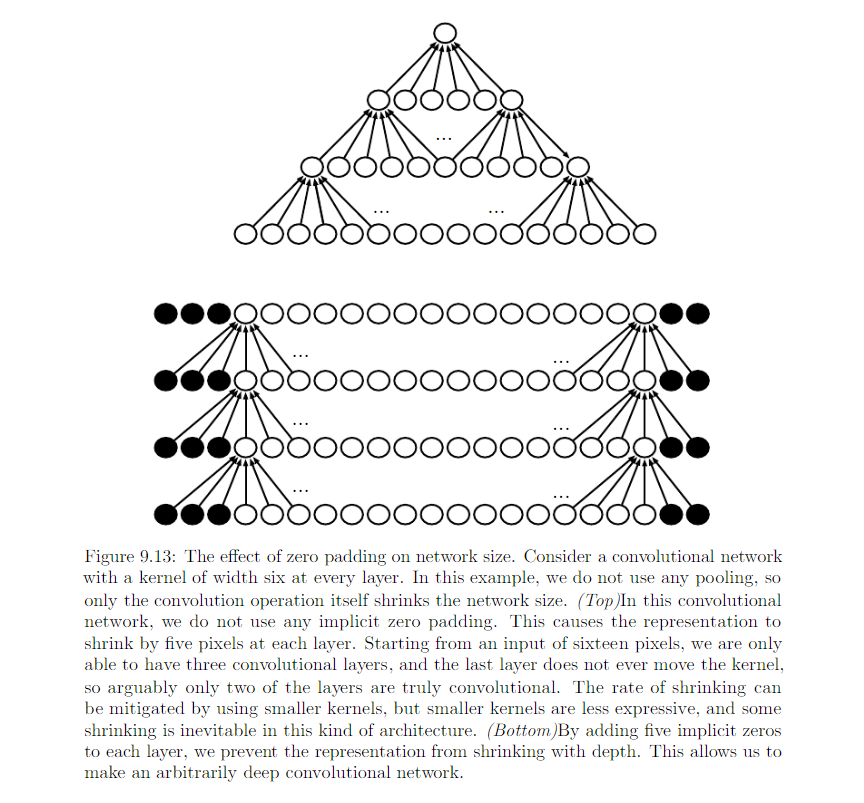
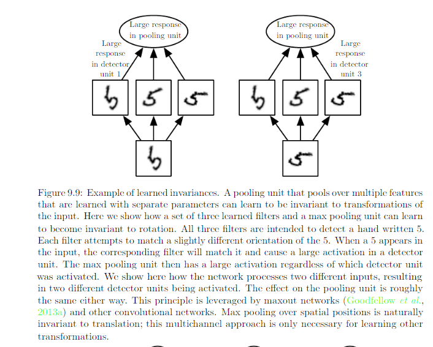

9.5 Variants of the Basic Convolution Function
================================================

Convolution in the context of NN means an operation that consists of many applications of convolution in parallel. 

* Kernel K with element :math:`K_{i, j, k, l}` giving the connection strength between a unit in channel i of output and a unit in channel j of the input, with an offset of k rows and l columns between the output unit and the input unit.
* Input: :math:`V_{i, j, k}` with channel i, row j and column k
* Output Z same format as V
* Use 1 as first entry

############################
Full Convolution
############################

*****************************
0 Padding 1 stride
*****************************
.. math::
	
	Z_{i, j, k} = \sum_{l, m, n} V_{l, j + m - 1, k + n - 1} K_{i, l, m, n}

*****************************
0 Padding s stride
*****************************

.. math::
	
	Z_{i,j,k} = c(K, V, s)_{i, j, k} = \sum_{l, m, n}[V_{l, s * (j - 1) + m, s * (k - 1) + n} K_{i, l, m, n}]

Convolution with a stride greater than 1 pixel is equivalent to conv with 1 stride followed by downsampling:

.. image:: Figure9.12.PNG

****************************
Some 0 Paddings and 1 stride 
****************************

Without 0 paddings, the width of representation shrinks by one pixel less than the kernel width at each layer. We are forced to choose between shrinking the spatial extent of the network rapidly and using small kernel. 0 padding allows us to control the kernel width and the size of the output independently.

Special case of 0 padding:

* Valid: no 0 padding is used. Limited number of layers.
* Same: keep the size of the output to the size of input. Unlimited number of layers. Pixels near the border influence fewer output pixels than the input pixels near the center.
* Full: Enough zeros are added for every pixels to be visited k (kernel width) times in each direction, resulting width m + k - 1. Difficult to learn a single kernel that performs well at all positions in the convolutional feature map.

Usually the optimal amount of 0 padding lies somewhere between 'Valid' or 'Same'

############################
Unshared Convolution
############################

In some case when we do not want to use convolution but want to use locally connected layer. We use **Unshared convolution**. Indices into weight W

* i: the output channel
* j: the output row;
* k: the output column
* l: the input channel
* m: row offset within input
* n: column offset within input

.. math::

	Z_{i, j, k} = \sum_{l, m, n} [V_{l, i + m - 1, j + n - 1} W_{i, j, k, l, m, n}] 

Comparison on local connections, convolution and full connection

.. image:: Figure9.14.PNG

Useful when we know that each feature should be a function of a small part of space, but no reason to think that the same feature should occur accross all the space. eg: look for mouth only in the bottom half of the image.

It can be also useful to make versions of convolution or local connected layers in which the connectivity is further restricted, eg: constrain each output channeel i to be a function of only a subset of the input channel.

Adv: 
* reduce memory consumption 
* increase statistical efficiency 
* reduce computation for both forward and backward prop. 

.. image:: Figure9.15.PNG

##################################
Tiled Convolution 
##################################

Learn a set of kernels that we rotate through as we move through space. Immediately neighboring locations will have different filters, but the memory requirement for storing the parameters will increase by a factor of the size of this set of kernels. Comparison on locally connected layers, tiled convolution and stardard convolution:  

.. image:: Figure9.16.PNG

K: 6-D tensor, t different choice of kernel stack

.. math::

	Z_{i, j, k} = \sum_{l, m, n}[V_{i, i + m - 1, j + n - 1}K_{i, l, m, n, j \% t + 1, k \% t + 1}]

Local connected layers and tiled convolutional layer with max pooling: the detector units of these layers are driven by different filters. If the filters learn to detect different tranformed version of the same underlying features, then the max-pooled units become invariant to the learned transformation. 

Review:

.. image:: Figure9.7.PNG

##################################
Back prop in conv layer
##################################

Back prop of conv layer:

* K: Kernel stack
* V: Input image
* Z: Output of conv layer
* G: gradient on Z

.. image:: ConvBackProp.jpg

##################################
Bias in after conv
##################################

We generally add some bias term to each output before applying nonelinearity. 

* For local conncted layers: give each unit its one bias
* For tiled conv layers: share the biases with the same tiling pattern as the kernels
* For conv layers: have one bias per channel of the output and share it accross all locations within each convolution map. If the input is fixed size, it is also possible to learn a seperate bias at each location of the output map.

###################################
Resources
###################################

* `Converting FC to CONV Layer <http://cs231n.github.io/convolutional-networks/#convert>`_
* `Technical Report Multidimensional Downsampled Convolution for Autoencoders <http://www.iro.umontreal.ca/~lisa/pointeurs/convolution.pdf>`_
