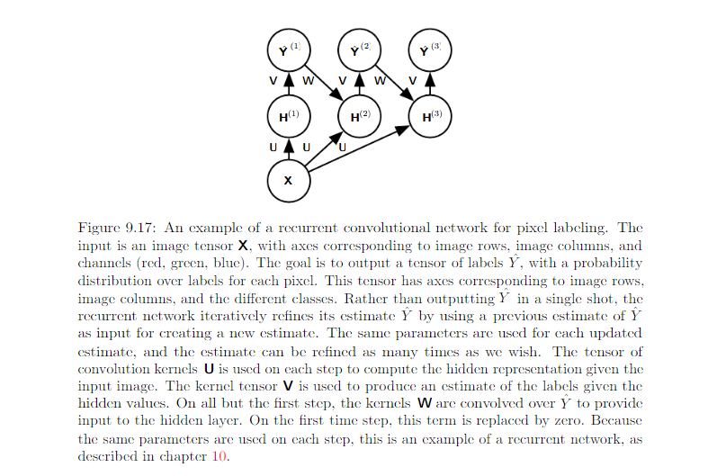

9.6 Structured Output
=========================

Convolution networks can be used to output a high-D structured object, rather than just redicting a class label for a classification task or a real value for regression tasks. Eg:

The model might emit a tensor **S** where :math:`S_{i, j, k}` is the probability that pixel (j, k) of the input belongs to class i.

Issue, the output plane can be smaller than input plane. Review:

.. image:: Figure9.13.PNG

Strategy for size reduction issue:

* avoid pooling altogether
* emit a lower-resolution grid of labels
* pooling operator with unit stride

One strategy for pixel-wise labeling of images is to produce an initial guess of the image label.

1. produce an initial guess of the image labels.
2. refine this initial guess using the interactions between neighboring pixels.

Repeat this refinement step serveral times corresponds to using the same convolution at each stage, sharing weights between last layers of the deep net. Recurrent Convolutional Network:

#################################
Resources
#################################

* `Combination of RNN and CNN <https://wiki.tum.de/display/lfdv/Recurrent+Neural+Networks+-+Combination+of+RNN+and+CNN>`_
* `Recurrent Convolutional Neural Networks for Scene Labeling <http://proceedings.mlr.press/v32/pinheiro14.pdf>`_
