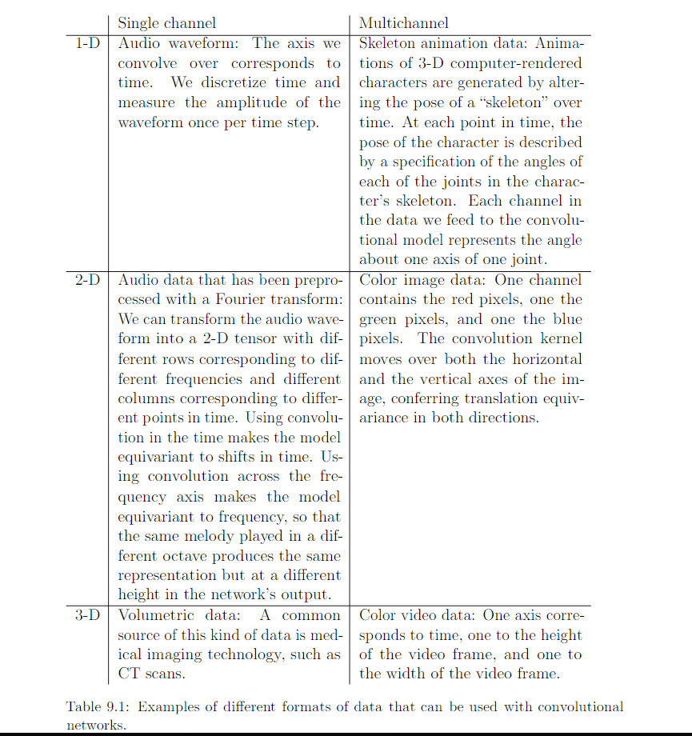

9.7 Data Type
======================

Conv Net can also process input with varing spetial extents.

Image with different size:

* No further design needed: label each pixel
* Further design such as add pooling layers whose pooling region scale in size proportional to the size of input: one label per image

Review:

.. image:: Figure9.11.PNG 

Convolution of different size of input

* Make sense: Same kind of observation, such as different size of image, different length of recording, different width of observation over space, and so forth.
* Not make sense: the input optionally have different kinds of observation such as convolving the same weights over features corresponding to the grades as well as the features corresponding to the test scores.

  