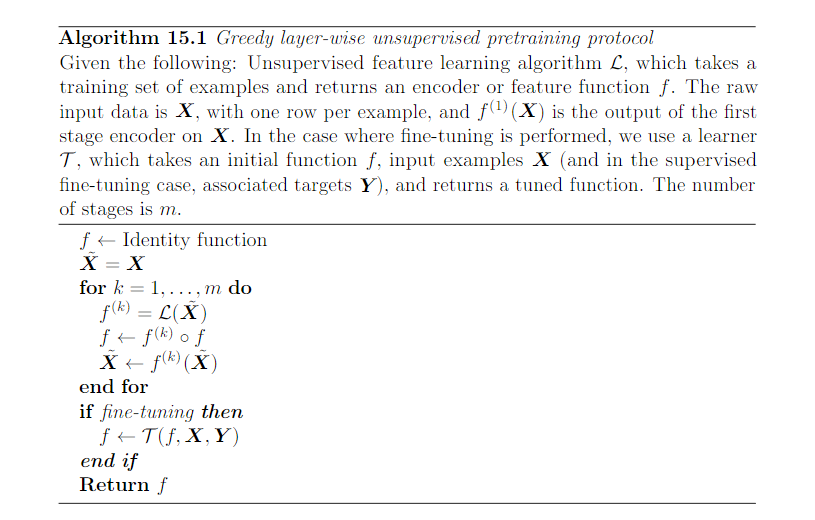
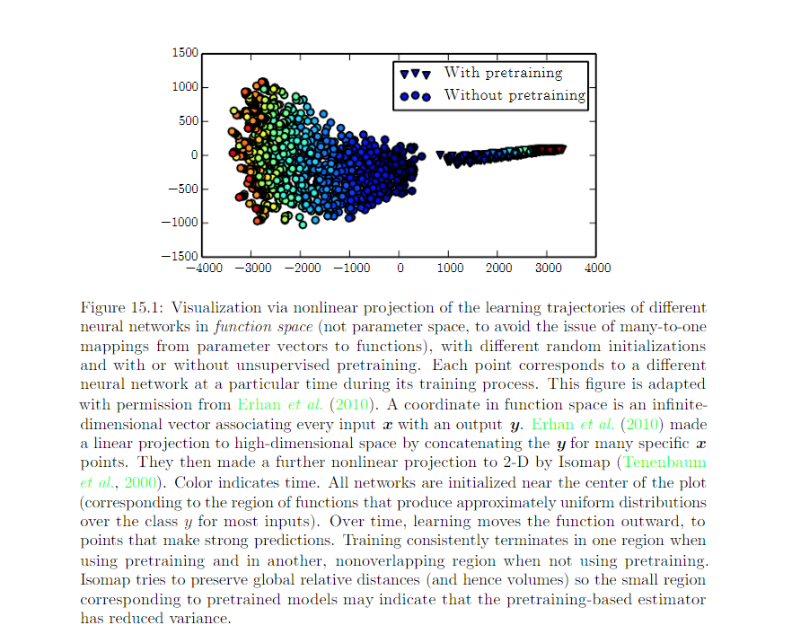

15.1 Gready Layer-Wise Unsupervised Pretraining 
================================================

Greedy Layer-Wise Unsupervised Pretraining relies on single-layer representation learning algorithm. Each layer is pretrained using unsupervised learning, taking the output of previous layer and producing as output a new representation of the data, whose distribution is hopefully simpler. 

Greedy layer-wise unsupervsied pretraining name explanation:

* Gready: Optimize each piece of the solution independently, on piece at a time.
* Layer-Wise: The independent pieces are the layer of the network. Training proceeds once layer at a time, training the k-th layer while keeping the previous ones fixed.
* Unsupervised: each layer is trained with an unsupervised representation learning algorithm.
* Pretraining:
	
	* 1st step/phase: Greedy Layer-Wise Unsupervised Pretraining
	* Fine-Tune all the layers together

In the context of supervised learning, it could be viewed as 
 
* Regulirizer
* A form a parameter initialization

Greedy Layer-Wise unsupervised pretraining can also be used as initialization for other unsupervised learning algorithms such as 

* Deep Autoencoders
* Probabilistic models with many layers of latent variables, including:
	
	* Deep Belief Network
	* Deep Boltzman Machines

################################################
When and why does unsupervised pretraining work
################################################

Unsupervised pretrining combines 2 ideas:

***********************************************************************************************************
Idea1: Choice of initial parameters for a deep NN can have a significant regularizing effect on the model
***********************************************************************************************************	
	
It remains possible that pretraining initializes the model in a location that would otherwise be inaccessible. Eg:

	1. a region surrounded by areas where the cost function varies so much from one example to another that minibatches give only a very noisy estimate of the gradient
	2. a region surrounded by areas where the Hessian matrix is so pooly conditioned that gradient descent methods must use very small steps.

We cannot charactorize the exactly what aspects of the pretrained parameters are retained during the supervised training stages. This is one of the reason why modern approaches typically use simultaneous unsupervised learning and supervised learning rather than two sequential stages.

You may also freeze the parameters for the feature extractor and use supervised learning only to add a classifier on top of the learned features.

************************************************************************************************************
Idea2: Learning about the input distribution can help with learning about the mapping from input to output.
************************************************************************************************************

Some features that are useful for the unsupervised task may also be useful for supervised task. This is not yet understood at a mathmatical, theoretical level. Many aspects of this approach are highly dependent on the specific models used. Eg: if we wish to add a linear classifer on top of pretrained features, the featrues mush make the underlyin classes linearly seperable. This is another reason that simultaneous supervised and unsupervised learning can be preferable.

**********************************************************
Interpretation to the function of unsupervised training 
**********************************************************

Unsupervised training as learning a representation: We can expect unsupervised pretraining to be more effective when the initial representation is poor. Eg: the use of word embedding. It is less useful for image processing perhaps because images lie in a rich vector space where distance provide a low quality similarity metrics. 

Unsupervised training as a regularizer: We can also expect unsupervised pretraining to be most helpful when the number of labeled examples is very small. 

Unsupervised pretraining is likely to be most useful when the function to be learned is extremely complicated. 

**********************************************************
Success case of Unsupervised Pretraining 
**********************************************************

Unsupervised pretraining has usually been used to improve classifier is usually interesting from the point of view of reducing test set error. It can help tasks other than classification.

Improvement to training error and test error maybe both explained in terms of unsupervised pretraining taking training into a region that would otherwise be inaccessible. 

* NN with unsupervised pretraining: halt in the same smaller region of function space. Suggesting that pretraining reduces the variance of function estimation process => reduce the risk of severe over fitting.
* NN wihout unsupervised pretraining: halt in another region. 

In another words: unsupervised pretraining initialize NN parameters into a region that they do not escape, and the results following this initializations are more consistent and less likely to be very bad than without pretraining.

******************************************************
Disadvantage of Unsupervised Pretraining
******************************************************

Operating with two seperate training phase. 

1. Unsupervsied pretraining does not offer a clear way to adjust the strength of the regularization arising from the unsupervised stage. When we perform unsupervised and supervised learning simultaneously, instead of using the pretraining strategy, there is a single hyperparameter, usually a coefficient attatched to the unsupervised cost, that determine hows strongly supervsied objective will regularize the supervsied model. 
2. Two seperate training phases has its own hyperparameters. The performance of the second phase cannot be predicted during the first phase, so there is a long delay between proposing hyperparameters for the first phase and being able to update them using feedback from the second phase. Most principled approach: use validation set error in the supervised phase to select hyperparameters of the pretraining phase.  

Today, unsupervised pretraining has been largely abandoned, except for natural language processing. 

Deep learning techniques based on supervised learning, regularized with dropout or batch normalization, are able to achieve human level performance on many tasks, but onlu with extremely large labeled datasets. On extremely small datasets, such as the alternative splicing dataset, Bayesian methods outperform methods based on unsupervised learning. 

The idea of pretraining has been generalized to supervised pretraining, as a common approach for transfer learning. 

Supervised pretraining for transfer learning is popular for use with convolutional networks pretrained on ImageNet dataset. Practitioners publish the parameters of the trained networks for this purpose, just as pretrained word vectors are published for natural language processing tasks.

Review on 8.7.4 Supervised pretraining:

.. image:: Figure8.7.PNG

