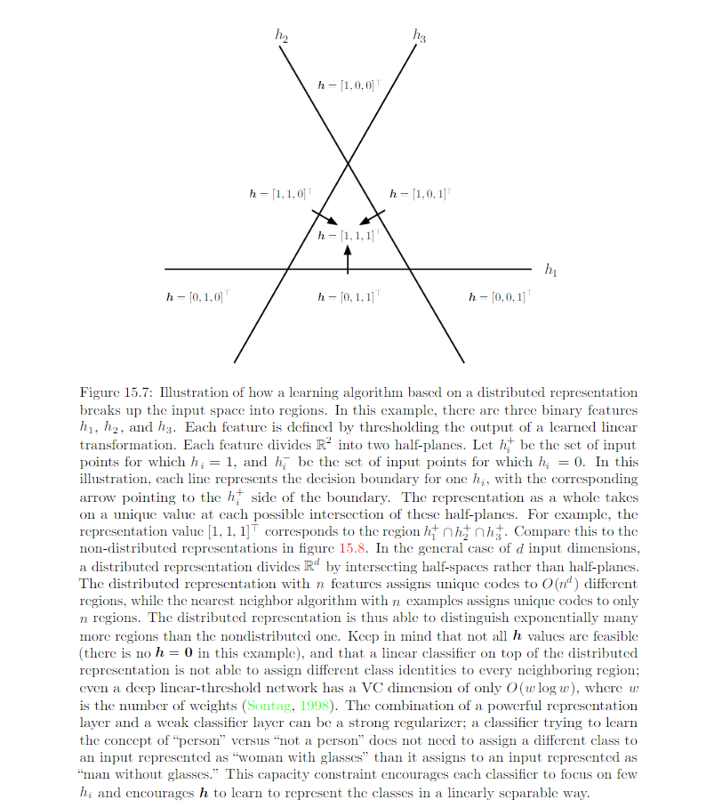

15.4 Distributed Representation
================================

* Distributed representations: representations composed of many elements that can be set seperately from each other. 
* Symbolic representation: the input is associated with **a single** simbol or a category. 
	
	* If there are n symbols in the dictionary, one can imagine n feature detctors, each corresponding to the detection of the presence of the associated category. 
	* Only n different configurations of the representation space are possible, carving n different regions in input space. 
	* Also called one-hot representation
	* One example of non-distributed representation.

Nondistributed representations: representations that may contain many entries but without significant meaningful seperate control over each entry. 

Examples of learning algo based on nondistributed representation learning:

* Clustering method, include the k-means algorithm: each input assigned to exactly one cluster
* `K Nearest neighbor <https://towardsdatascience.com/introduction-to-k-nearest-neighbors-3b534bb11d26>`_: If k > 1, multiple values describe each input, but they cannot be controlled seperately from each other, so this does not qualify as a true distributed representation.
* Decision tree: Only one leaf is activated when the input is given
* Gaussian mixture and mixtures of expert: each input is represented with multiple values, but those values cannot be readily be controlled seperatly from each other.
* Kernel machine with a Gausian kernel
* Language or translation models based on g-grams

See the review for some of the ML algorithms at the end of this summary E.g. of 3 binary features representation: 

E.g. of non-distributed representation: nearest neighbor

.. image:: rsc/Figure15.8.PNG

One important concept in distributed representation: generalization arised due to shared attributes between different concepts. Distributed representation include a rich similarity space, in which semantically close concepts (or inputs) are close in distance. This is a property absnet from purely symbolic representation.

Distributed representation can have statistical advantages when an apparently complecated structure can be compactly represented using a small number parameters.

E.g. See figure 15.7. Each binary feature binary feature in this representation divides :math:`\mathbb{R}^d` into a pair of half spaces. The exponentially large number of intersection of n of correcponding half spaces determines how many regions this distributed representation learner can distinguish. The number of regions this binary feature representation can distinguish is 

.. math::
	\sum ^d_{j=0} \begin{pmatrix} n \\ j \end{pmatrix} = O(n^d)

We can see a growth that is exponential in the input size and polynomial in the number of hidden units. 

With O(nd) parameters (for n linear threshold features in :math:`\mathbb{R}^d`), we can distinctly represent :math:`O(n^d)` region in the input space. If we have assumption at all about the data, and used a representation with one unique symbol for each region and seperate parameters for each symbol to recognize its corresponding portion of :math:`\mathbb{R}^d`, the specify :math:`O(n^d)` region would require :math:`O(n^d)` examples. 

If a parametric transformation with k parameters can learn about r regions in input space, with k << k, and if obtaining such a representation was useful to the task of interest, then we could potentially generalize much better in this way than in a nondistributed settings, where we would need O(r) exmaples to obtain the same features and associated partitioning of the input space into r regions. 

Another reason why distributed representation generalize well: their capacity remains limited despite being able to distincly encode so many different regions. 
Reason of limited capacity: While we can assign very many unique codes to representation space, we cannot use absolutely all the code space, nor can we learn arbitrary functions mapping from the representation space h to the outputs space y using a linear classfier. The use of distributed representation combined with a linear classifier thus express a prior belief that the classes to recognized are linearly seperable as a function of the underlying causal factors captured by h. e.g we don't want to partition data into the set of all red cars and green trucks as one class and the set of all green cars and red trucks as another class.   

Valdation of distributed representation:

.. image:: rsc/Figure15.9.PNG

###############################
Review on KNN 5.7.3
###############################

One weakness of k-nearest neighbors is that it cannot learn that one feature is more discriminative than another. For example,imagine we have a regression task withx ∈ R 100 drawn from an isotropic Gaussian distribution, but only a single variable :math:`x_1` is relevant to the output. Suppose further that this feature simply encodes the output directly, that :math:`y=x_1` in all cases. Nearest neighbor regression will not be able to detect this simple pattern.The nearest neighbor of most pointsx will be determined by the large number of features :math:`x_2` through :math:`x_{100}`, not by the lone feature :math:`x_1`. Thus the output on small training sets will essentially be random.

################################
Review on decision tree 5.7.3
################################

.. image:: rsc/Figure5.7.PNG

############################
Resources
############################

* `K Nearest neighbor <https://towardsdatascience.com/introduction-to-k-nearest-neighbors-3b534bb11d26>`_