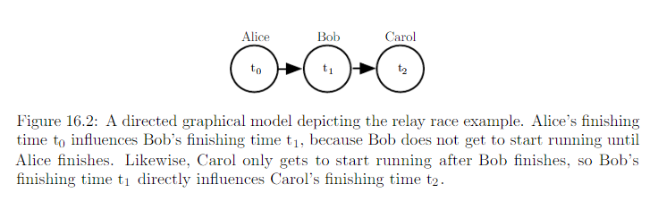
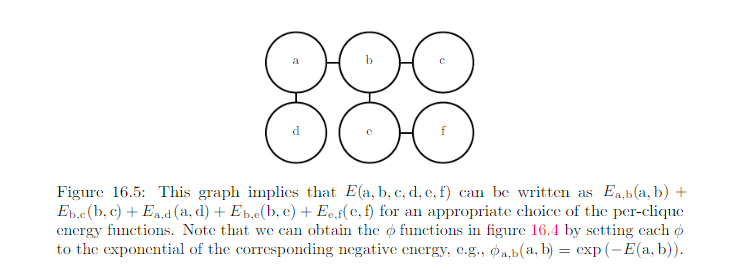
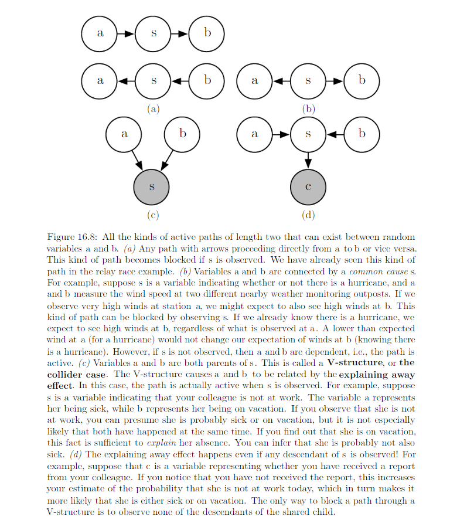
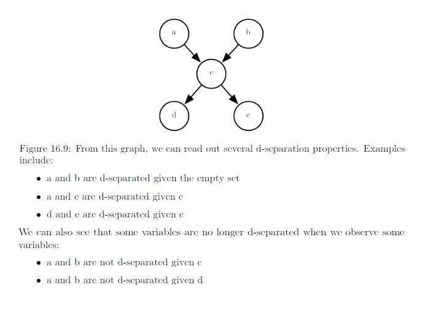
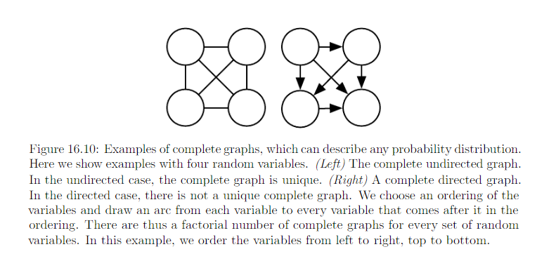
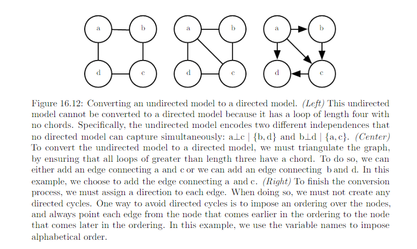
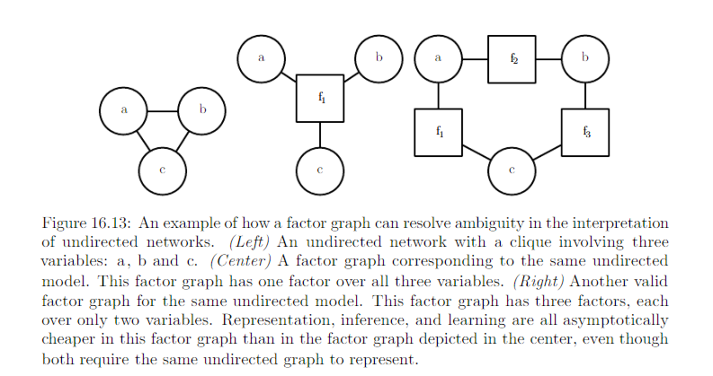

16.2 Using Graphs to Describe Model Structure
===============================================

Structured probablistic models use graphs to represent interactions between random variables. Each node represents a random variable. Each edge represents a direct interaction

#########################################################
16.2.1 Directed Models
#########################################################

Directed graphical model, aka, belief network or Bayesian network. The edges are directed. The direction of the arrow/edge indicates which variable's probablistic distribution is defined in terms of the other's. E.g. :

A directed graphical model defined on variable x is defined by a directed acyclic G whose vertices are the random variables in the model, and a set of local conditional probability distribution :math:`p(x_i|Pa_G(x_i))`, where :math:`Pa_G(x_i)` gives the parents of :math:`x_i` in G. The probability distribution over x given by

.. math::
	p(x) = \prod_i p(x_i|pa_G(x_i))

In general, to model n discrete variables each having k values, the cost of the single table approach scales like :math:`O(k^n)`. Suppose we build a directed graphical model over these variables. If m is the maximum number of variables appearing (on either side of the conditioning bar) in a single conditional probability distribution, then the cost of the tables for the directed models scales like :math:`O(k^m)`. As long as we can design a model such that m << n, we can get very dramatic savings.

In ithe words, as long as each variable has few parents in the graph, the distribution can be represented with very few parameters. Some restrictions such as requiring it to be a tree can guarantee that operations like computing marginal or conditional dirstibution over subsets of variable are efficient.

The graph encodes only simplifing assumptions about which variables are conditionally independent from each other. The directed graph syntaxt does not place any constraint on how we define our conditional distributions. It only defines which variables they are allowed to take in as arguments. 

#########################################################
16.2.2 Undirected Models
#########################################################

Undirected model, aka, Markov random fields (MRFs) or Markov Networks. 

* Directed models: applicable to situation where there is a clear reason to draw each arrow in one particular directions, where we understand the causality and causality flows in only one direction. 
* Undirected model: when the interactions seem to have no intrinsic direction, or to operate in both directions

As with directed model, if 2 nodes in an undirected model are connected by an edge, then the random variables corresponding to those nodes interact with each other directly. e.g

.. image:: rsc/Figure16.3.PNG

An undirected graphical model is a structured probabilitic model defined on an undirected graph G. For each clique C in the graph, a factor :math:`\phi(C)` (also called a clique protential) measures the affinity of the variables in that clique for being in each of their possible joint states. :math:`\phi(C) > 0`. Unnormalized probability distribution:

.. math::
	\hat{p}(x) = \prod_{C\in G}\phi(C)

A clique of the graph is a subset of nodes that are all connected to each other by an edge of the graph.

It is efficient as long as all the cliques are small. It encodes the idea that states with higher affinity are more likely. Check the example in Page 558.

#########################################################
16.2.3 The partition Function
#########################################################

To obtain a valid probability distribution, we must use the corresponding normalized probability distribution. 

.. math::
	
	p(x) = \frac{1}{Z}\hat{p}(x)

where Z is the value that results in the probability distribution summing or integrting to 1

.. math::
	
	Z = \int \hat{p}(x)dx

You can think of Z as constant when :math:`\phi` functions are held constant. Note that if the :math:`\phi` functions have parameters, then Z is a function of those parameters. Normalizing function Z is known as partition function.

Z: integral or sum over all possible joint assignment of the state z -> often intractable to compute. So, the model structure and the definitions of the :math:`\phi` must be constructive to computing Z efficiently. In the context of DL, we must resort to approximations. 

When designing undirected models: it is possible to specify the factors in such a way that Z does not exist. This happens if some of the variables in the model are continous and the integral of :math:`\hat{p}(x)` over their domain diverges. Sometimes the choice of some parameter of the :math:`\phi` determines whether the probability distribution is defined.

Difference between directed and undirected modeling

* Directed models: defined directly in terms of probability distribution from the start.
* Undirected models: defined more loosely by :math:`\phi` functions that are then converted into probability distributions. 

Domain of each of the variables has dramatic effect on the kind of probability distribution that a given set of  :math:`\phi` functions corresponds to. E.g.

* An n-D vector valued random variable x 
* Undirected model parameterized by a vector of bias b.

.. math::

	\phi ^i (x_i) = exp(b_ix_i)

| 1. If :math:`x \in \mathbb{R}^n`
| Then the integral defining Z diverges and no probability distribution exists

2. If :math:`x \in \{ 0, 1 \}^n`

Suppose: 

.. math::
	\vec{y} = \{x_2, x_2, x_3, ... x_n\}

Then we have:

.. math::

	\begin {equation}
	\begin{split}
	p(x_1 = 1) & = \frac{\int \phi^{(1)}(x_1=1)\phi^{(2)} \phi^{(3)} \phi^{(4)}..dy }{\int \phi^{(1)}(x_1=1)\phi^{(2)} \phi^{(3)} \phi^{(4)}..dy + \int \phi^{(1)}(x_1=0)\phi^{(2)} \phi^{(3)} \phi^{(4)}..dy } \\ 
	& = \frac {\phi(x_1 = 1)}{\phi(x_1 = 1) + \phi(x_1 = 0)} \\
	& = \frac {exp(b_1)}{1 + exp(b_1)}\\
	& = sigmoid(b_1)
	\end{split}
	\end {equation}

3. If x is one-hot vector {[1, 0, 0, 0 ...], [0, 1, 0, 0 ...], [0, 0, 1, 0 ...]}

.. math::
	\begin{equation} \label{eq1}
	\begin{split}
	\hat{p}(\vec{x}) & = e^{b_i} * 1 * 1 * 1 * .....\\
	& = e^{b_i}
	\end{split}
	\end{equation}

so we have 

.. math::
	\begin{equation} 
	\begin{split}
	Z & = \int \phi^1 * \phi^2 * \phi^3 ... dx \\
	& = e^{b_1} + e^{b_2} + e^{b_3} + e^{b_4} + e^{b_5} + ..... 
	\end{split}
	\end{equation}

So:

.. math::
	\begin{equation} 
	\begin{split}
	p(x) & = \frac{e^{b_i}}{e^{b_1} + e^{b_2} + e^{b_3} + e^{b_4} + e^{b_5} + ..... } \\
	& = softmax(b)
	\end{split}
	\end{equation}
 
Oftenm it is possible to leverage the effect of a carefully chosen domain of a variable to obtain complicated behaviour from a relatively simple set of :math:`\phi` functions. 

#########################################################
16.2.4 Energy-Based Model
#########################################################

Many interesting theoretical results about undirected models depend on the assumption that :math:`\forall x, \hat{p}(x) > 0`. A convinient way to enforce this condition is to use energy based model (EBM) where

.. math::
	\hat{p}(x) = exp(-E(x))

and E(x), aka, energy function. By learning the energy function, we can use unconstrained optimization. Any distriburuib of the form given by the equation above is an example to Boltzmann distribution. 

* Boltzmann Machine is today most often used to disignate models with latent variables
* Boltzmann machines without latent variables are more often called Markov random field or log-linear models.

Because exp(a)exp(b) = exp(a + b), this means that different cliques in the undirected graph corresponds to different terms of the energy function. In other words, an energy-based model is just a special kind of Markove network: the exponentiation makes each term in the energy function correspond to a factor for a different clique.  

One can view an energy-based model with multiple terms in its energy function as being a product of experts. Each term in the energy function corresponds to another factor in the probability distribution. Each term of the energy function can be thought of as an "expert" that determines whether a particular soft constraint is satisfied. Each expert may enfoce only one constraint that concern only a low-D projection of the random variables, but we combined by multiplication of probabilities, the expert together enforce a complicated high-D constraint.

Mony Algorithms that operate on probabilistic models need to compute not :math:`p_{model}(x)` but only :math:`log \hat{p}_{model}(x)`. For EBM with latent variables h, these algorithms are sometimes phrased in terms of the negative of this quantity, called the free energy:

.. math::
	F(x) = -log \sum_h exp(-E(x, h))

#########################################################
16.2.5 Sparation and D-Separation
#########################################################

We often need to know which variables indirectly interact. Some of these interactions can be enabled or disabled by observing other variables. More formallym we would like to know which subsets of variables are conditionally independent from each other, given the values of other subsets of variables. 

Conditional independence implied by the graph is called seperation. We say a set of variables A is seperated from another set of variable B give a third  set of varibles S if the graph structure implies that A is independent from B given S. 

* If two variables a and b are connected by **a path** involving **only** unobserved variables, then those varibles are not seperated. 
* If **no path** exists between them, or **all paths** contain an observed variable, then they are seperated. 

* Refer path involving only unobserved variables as "active" 
* Refer path involving an observed variable as "inactive"

e.g.

.. image:: rsc/Figure16.6.PNG

.. image:: rsc/Figure16.7.PNG

In the context of directed model, those concerpts are referred to as d-seperation. The "d" stands for dependence.  A set of variables A is d-seperated from another set of variable B given a third set of variables S if the graph structure implies that A is independent from B given S. 

Two variables are dependent if there is an active path between them and d-sperated if no such path exists. How to check if an active path exists:

Note: seperation and d-seperation tell us only about those conditional independences that are implied by the graph. There is no requirement that the graph imply all independences that are present. Some distributions contain independences that are not possible to represent with existing graphical notation. Context-independences are independences that are present dependent on the value of some variables in the network. 

In general, a graph will never imply that independence exists when it does not. However, it may fail to encode an independece.

#########################################################
16.2.6 Converting between undirected and directed graphs
#########################################################

We typically refer to RBMs as undirected and sparse coding as directed. Some models are most easily described using a directed graph, or most easily described using a undirected graph.

We may choose to use either directed or undirecte modeling based on 

* which approach uses fewest edges to describe the edges
* if we observe a certain subset of variables
* if we wish to perform different computational task.
* others

e.g. 

* directed model description often provides a straight forward approach to efficiently draw samples from the model (16.3).
* undirected model description is often useful for deriving approximate inference procedures (P640 equation 19.56)

Every probability distribution can be represented by either directed or undirected model. In the worst case, one can alwasy represent any distribution by using a "completed graph"

* For directed graph: impose some ordering on the random variables.
* For undirected graph: simply a graph containing single clique encompassing all the variables 

Please note: "arc from each variable to **every** variable that comes after it in the ordering".

1. Directed models are able to use one specific substructure that undirected models cannot represent: Immorality 
2. Vice Versa. Specifically when undirected model contains a loop of length greater than , unless the loop contains a chord. A chord is connection between any two nonconsecutive variables in the sequence defining a loop. If undirected model has loops of length >= 4 and does not have chords for those loops, we must add the chords before we can convert it to a directed model. Adding chords discards some of the independence information that was encoded in U. The graph formed by adding chords to U is known as a chordal or triangulated graph, because all the loops can be described in terms of smaller, triangular loops. To build a directed graph from the chordal graph, we need to also assign directions to the edges. When doing so we must not create a directed cycle in the model. One way to assign direction to edges is to impose an ordering on teh random variables. 

Examples

.. image:: rsc/Figure16.11.PNG

#########################################################
16.2.7 Factor Graphs
#########################################################

Factor graphs are another way of drawing undirected models that resolve an ambiguity in the graphical represenatation of std undirected model syntax. In an undirected model, the scope of every :math:`\phi` function must be a subset of some  clique in teh graph. Ambiguity arises because it is not clear if each clique actually has a corresponding factor whose scope encompasses the entire clique. Circle: random variables. squares: factors :math:`\phi`. 

No factor maybe connected to another factor in the graph, nor can a variable be connected to a variable. 

##################################
Resources
##################################

* `Restricted Boltzmann Machines Part I <https://towardsdatascience.com/deep-learning-meets-physics-restricted-boltzmann-machines-part-i-6df5c4918c15>`_