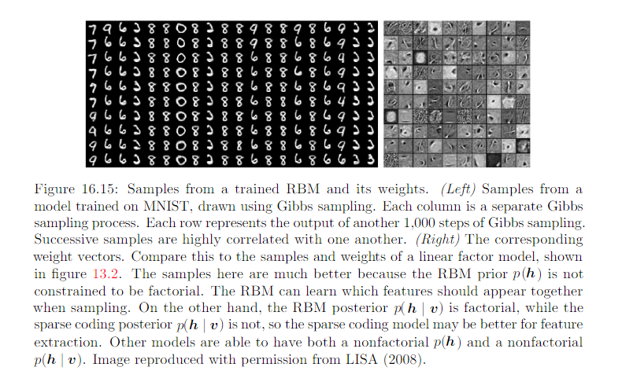
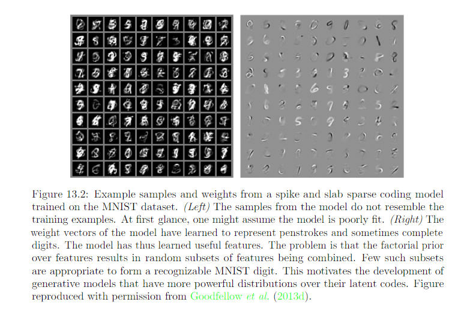

16.7 The Deep Learning Approach to Structured Probabilistic Models
====================================================================

In the context of graphical model, the depth of a model: a latent variable :math:`h_i` as being at depth j if shortest path from :math:`h_i` to an observed variable is j steps. 

Many genarative models used for DL have no latent variables or only one layer of latent variables but use deep learning computational graphs to define the conditional distribution within a model. 

* DL  

	* always makes use of the idea of distributed representations. 
	* DL models typically have more latent variables than observed variables. 
	* Complicated nonlinear interaction between variable are accomplished via indirect connection that flow through multiple latent variables. 
	* does not intend for the latent variables to take on any specific semantic ahead of time, training algorithms is free to invent the concepts it needs to model a particular dataset.Hard to interpret, easier to scale and reuse. 
	* Large group of units are typically all connected to other groups of units, so that the interaction between 2 groups can be described by a single matrix.
	* Loopy belief propagation is almost never used for DL. Most deep models are instead designed to make Gibbs sampling or variational inference algorithms efficient. 
	* Large number of latent varible makes efficient numerical code essential. Additionally motivates: grouping the units into layers with a matrix describing the interaction between 2 layers. This allows individual steps of the algorithm to be implemented with efficient matrix product operation, or sparsely connected generalization.
	* Increase the power of model until it is just barely possible to train. The DL approach is often to figure out what the minimum amount if info we absolutely need is, and then to figure out how to get a reasonable approximation of that information as quickly as possible. 

* Traditional graphical model 

	* usually contain mostly variables that are at least occasionally observed, even if many many of the variables are missing at random from some training examples. 
	* Use high order terms and structure learning to capture complicated nonlinear interactions between variables.
	* latent variable designed with some specific semantic in mind. Easier to interpret have more theoretical guarantees, less able to scale to complex problem and not reusable 
	* Typically have very few connections. The choice of each variable might be individually designed. 
	* The design of the model structure is tightly linked with the choice of inference algorithms. 
	* Typically aim to maintain the tractability of exact inference. When this constraint is too limiting, a popular approximate approach algorithms are called loopy belief propagation. 

**************************************************
16.7.1 Example: The Restricted Boltzman Machine
**************************************************

* Units are organized into large groups called layers
* Connectivilty described by matrix
* Connectivity relatively dense
* Desiged to allow efficient Gibbs Sampling 
* Freeing the training algorithm to learn latent variables whose semantics design is not specified by the designer.

**Review on undirected model and energy based model:**

An undirected graphical model is a structured probabilitic model defined on an undirected graph G. For each clique C in the graph, a factor :math:`\phi(C)` (also called a clique protential) measures the affinity of the variables in that clique for being in each of their possible joint states. :math:`\phi(C) > 0`. Unnormalized probability distribution:

.. math::
	\hat{p}(x) = \prod_{C\in G}\phi(C)

A clique of the graph is a subset of nodes that are all connected to each other by an edge of the graph.

Many interesting theoretical results about undirected models depend on the assumption that :math:`\forall x, \hat{p}(x) > 0`. A convinient way to enforce this condition is to use energy based model (EBM) where

.. math::
	\hat{p}(x) = exp(-E(x))

and E(x), aka, energy function. By learning the energy function, we can use unconstrained optimization. Any distriburuib of the form given by the equation above is an example to Boltzmann distribution. 

* Boltzmann Machine is today most often used to disignate models with latent variables
* Boltzmann machines without latent variables are more often called Markov random field or log-linear models.

**Now we come back to RBM**

.. image:: rsc/Figure16.14.PNG

The canonical RBM RBM is an energy based model with binary visible and hidden units

With the graph above, we can see that there is no triangle clique. So each edge forms 1 clique and its factor function of clique :math:`\{v_i, h_j\}` would look like this: 

.. math::
	\phi(C_{i, j}) = exp(b_i*v_i + c_j*h_j + v_i*w_{i, j}*h_j)

That is why the factor function with the graph as a whole looks like:

.. math::
	\phi(\vec{v}, \vec{h}) = \prod_{i, j} \phi(C_{i, j}) = exp(\vec{b}^T\vec{v} + \vec{c}^T\vec{h} + \vec{v}^TW\vec{h})

We also have Z as normalizing constant:

.. math::
	Z = \sum_\vec{v}\sum_\vec{h}exp(\vec{b}^T\vec{v} + \vec{c}^T\vec{h} + \vec{v}^TW\vec{h})

Now we derive the conditional distribution from the joint distribution (ignored the vector sign for simplicity):

.. math::
	\begin{equation} 
	\begin{split}
	P(h, v) & = \frac{P(h, v)}{P(v)} \\
	& = \frac{1}{P(v)}\frac{1}{Z}exp\{b^Tv + c^Th + v^TWh\} \\
	& = \frac{1}{Z'}exp\{c^Th + v^TWh\} \\
	& = \frac{1}{Z'}exp\{ \sum_{j=1}^{n_h}c_jh_j + \sum_{j=1}^{n_h}v^TW_{:, j}h_j \} \\
	& = \frac{1}{Z'} \prod_{j=1}^{n_h}exp\{ c_jh_j +  v^TW_{:, j}h_j \}
	\end{split}
	\end{equation}
	
Since we are conditioning on the visible units v, we can treat these as constant with respect to the distribution P(h|v). Next, we can derive:

.. math::
	\begin{equation} 
	\begin{split}
	p(h_j = 1|v) & = \frac{\hat{P}(h_j = 1)| v}{\hat{P}(h_j = 1) + \hat{P}(h_j = 0)} \\
	& = \frac{exp\{c_j + v^TW_{:, j}\}}{exp\{ 0 \} + exp\{c_j + v^TW_{:, j}\}}\\
	& = \sigma(c_j + v^TW_{:, j})
	\end{split}
	\end{equation}

Together, those properties allow for efficient block Gibbs sampling, which alternates between:

* sample all of h simultaneously 
* sample all of v simultaneously

Compare to linear factor model:

Efficient Gibbs sampling and efficient derivatives makes training convenient. 

RBM demonstrats the typical DL approach to graphical models: representation learning accomplished via layers of latent variables, combined with efficient interaction between layers parameterized by matrices.

 