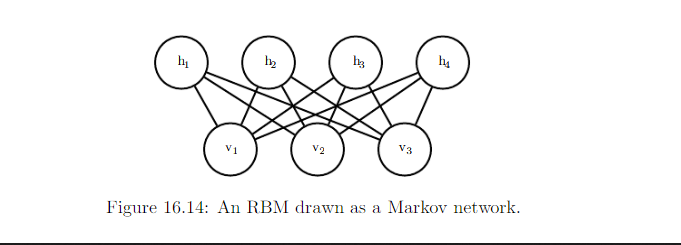

17.4 Gibbs Sampling
==============================

Draw sample from distribution q(x): updating :math:`x \leftarrow x' \sim T(x'|x)`

* Problem: how to ensure that q(x) is a useful distribution
* Solution:
	
	* Derive T from a goven learned model :math:`p_{model}`
	* Directly parameterize T and learn it, so that its stationary distribution implicitely define the :math:`p_{model}` of interest. 

In DL, we commonly use Markov chain to draw samples from an energy-based model defining a distribution :math:`p_{model}(\vec{x})`. In this case, we want the :math:`q(\vec{x})` for the Markov chain to be :math:`p_{model}(\vec{x})`. To obtain the desired q(x), we must choose an appropriate :math:`T(x'|x)`

Gibbs sampling: sampling from :math:`T(x'|x)` is accomplished by selecting one variable :math:`x_i` and sample it from :math:`p_{model}` conditioned on it neighbor in the undirected graph G defining the structure of the energy based model. We can also sample several variables at the same time as long as they are conditionally independent given all their neighbors. 

e.g Restricted Boltzman Machine

all the hidden units of an RBM maybe sampled simultaneously because they are conditionally independent from each other given all the hidden units. Gibbs sampling approaches that update many variables simultaneously in this way are called blocled Gibbs sampling.

