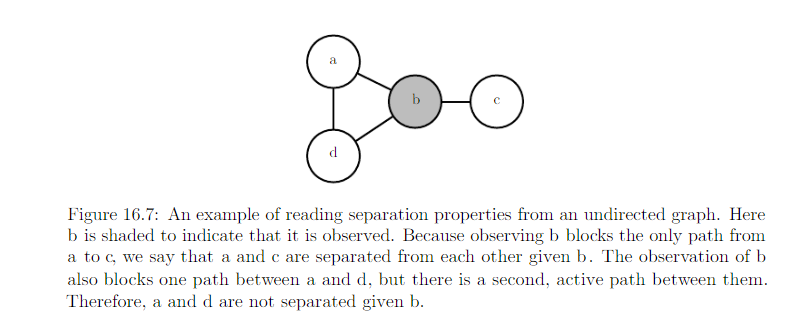
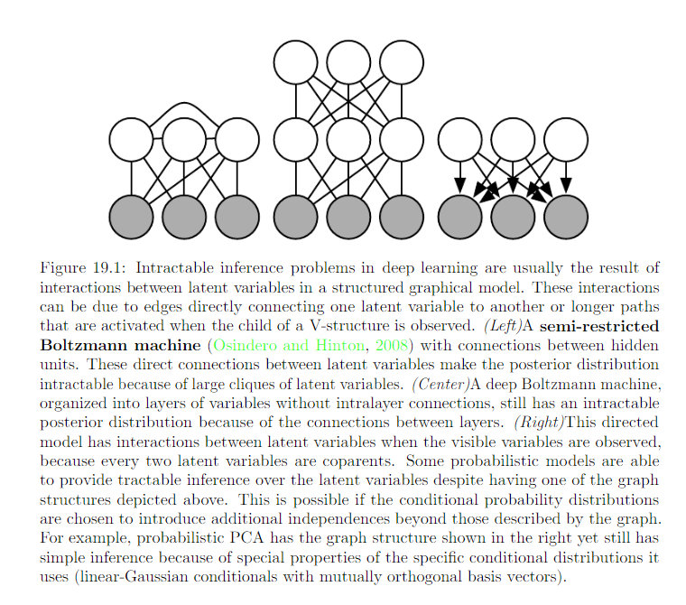

19 Approximate Inference
============================

* v: visible variables
* h: hidden variables

Challenge of inference: compute p(h|v) or take expectation with respect to it.

Review:

.. image:: rsc/Figure16.6.PNG

.. image:: rsc/Figure16.8.PNG

Direct interaction in undirected model / explaining away interaction between mutual ancestors of the same visible unit in directed model ==> interaction between latent variables => Intractable inference problem.

.. toctree::
   :maxdepth: 1

   19.1 Inference as Optimization
   