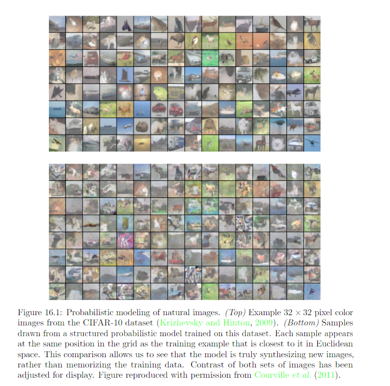

20.14 Evaluating Generative Models
====================================================

Often, cannot evaluate log(x) under the model, but we can evaluate only a approximation. In these cases, it is important to think and communicate clearly about what exactly is being measured.

Evaluation metrics are often hard research problems in and of themselves.

Other fields of machine learning usually allows for some variation in the preprocessing of the data. Examples: MNIST dataset. check textbook for example

Practioners often evaluate generative models by visually inspecting the samples. Unfortunately, it is possible for a very poor probablistic model to produce very good samples

Visual quality of samples not reliable -> evaluate log-likehood the model assigns to the test data. Unfortunately, in some cases the likehood seems not to measture any attribute of the model that we really care about. Example: assigne high likehood to MNIST dataset because of the background.

There are many different uses of generative models and the choice of metrics must match the intended use of the model